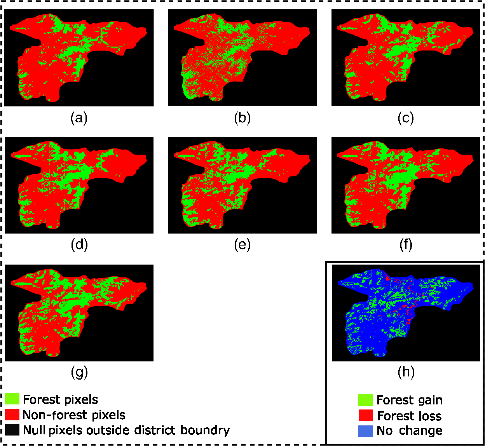

# AI-ForestWatch: Semantic Segmentation based End-to-End Framework for Forest Change Detection Using Multi-spectral Remote Sensing Imagery

This repository contains the dataset and code used to develop the AI-ForestWatch framework for forest change detection. 

We perform pixelwise segmentation with U-Net to detect forest cover change as part of the [Billion Trees Tsunami Project](https://en.wikipedia.org/wiki/Billion_Tree_Tsunami).

## Description

The aim of this project is to use Landsat-8 imagery to perform forest cover change detection in the Billion Tree Tsunami Afforestation Regions in Pakistan. We do binary land cover segmentation of an image into forest/non-forest classes for our Areas of Interest (AOI), then repeat the same for a whole 7-year temporal series of images from 2014 to 2020 and lastly, compare them to see what forestation changes occured in selected areas. The selected image below shows our results for Battagram district from 2014 to 2020, where red pixels are non-forest labels, green pixels are forest labels and the last image shows overall gain/loss map from 2014 to 2020.



## Folder Structure
  ```
  AI-ForestWatch/
  │
  ├── train.py - main script to start training
  ├── inference.py - inference using trained model
  │
  ├── config.json - holds configuration for training
  ├── parse_config.py - class to handle config file and cli options
  │
  ├── base/ - abstract base classes and data generation
  │   ├── base_data_loader.py
  │   ├── base_dataset.py
  │   ├── base_model.py
  │   └── base_trainer.py
  │   └── datagen.py
  │
  ├── data_loader/ - anything about data loading
  │   └── data_loaders.py
  │
  ├── data/ - default directory for storing input data
  │
  ├── model/ - models, losses, and metrics
  │   ├── model.py
  │   ├── metric.py
  │   └── loss.py
  │
  ├── saved/
  │   ├── error_maps/ - error_maps are saved here
  │   ├── models/ - trained models are saved here
  │   └── log/ - default logdir for logging output
  │
  ├── trainer/ - trainers
  │   └── trainer.py
  │
  ├── logger/ - module for logging
  │   ├── logger.py
  │   └── logger_config.json
  │  
  └── utils/ - small utility functions
      └── util.py
  ```


## Usage
First install necessary requirements using 

    pip install -r requirements.txt

## Data Collection
First you need to create the necessary pickle files used for either training or inference. These can be generated using data from Landsat8. We used images from 2014, 2016-2020 for training and 2015 for inference. If you want to use your own files, then you can use Google Earth Engine. 
Both training and testing data may be found in [this drive folder](https://drive.google.com/drive/folders/1-YQrkbG--F1MeYkW6izYWhP19K1QWijN?usp=sharing). Create `data/landsat8` folder and store the data there .

Once you obtain the necessary `.tiff` files, you can use [`get_images_from_large_file`](./base/datagen.py#L37) to generate the pickle dataset. Create a folder called `data/pickled_dataset/` and store the pickled files for each region/year there. For now, it's assumed that you only downloaded train data. If you want to store train and test pickle files separately, then you need to create two folders `data/pickled_dataset/train` and `data/pickled_dataset/test`. 

Having done so, it is possible to generate training, validation and testing dataloaders. Doing this for the first time may take longer than subsequent attempts. So, it is recommended to initialize [`Landsat8DataLoader`](./data_loader/data_loaders.py#L14) for all three sets of data once before training. 

## Training
Training is done using U-Net Topology with VGG11 backbone. A sample [pretrained model](./config.json#L57) that we have trained is used as the default checkpoint. If it is not found, then training will start from scratch unless a checkpoint is provided through command line.

The following command starts training of the model using the options specified in `./config.json`. The optional keyword argument `--config path/to/config.json` can be used to specify another config file to be used.

  ```
  python train.py
  ```

### Resuming from checkpoints
You can resume from a previously saved checkpoint by:

  ```
  python train.py --resume path/to/checkpoint
  ```
  
#### Optional Keywords

  ```
  --lr --learning_rate
  --bs --batch_size
  --epochs
  --topology : should be one of the following (ENC_1_DEC_1, ENC_2_DEC_2, ENC_3_DEC_3, ENC_3_DEC_3)
  ```

## Inference
For inference, two data directories are required. These include:

 1. `.tif` images from Google Earth Engine or any dataset (e.g.
    Landsat8) are required
 2. Shapefiles for these images

We have provided our own datasets for containing this file in the provided Google Drive folder. We have specified the paths to these datasets in the [configuration file](./config.json#28).  You can change these to point to your own dataset.

You may use our pretrained model for inference or pass another checkpoint. By default, if you run `python inference.py`, then inference will be performed for all files in `data_path` directory. If you wish to perform inference for specific districts and/or years, an example command is as follows:

`python inference.py -d abbotabad battagram -y 2015 2016`  

The output of this script will be saved in the most recent experiment folder inside `./saved/inference/`

## Acknowledgements
- Part of this research is supported by the German Academic Exchange Service (DAAD) under grant no. 57402923.
- This project has followed the PyTorch template provided by [victoresque](https://github.com/victoresque/pytorch-template)
 
 ## Reference 

    @article{10.1117/1.JRS.15.024518,
    author = {Annus Zulfiqar and Muhammad M. Ghaffar and Muhammad Shahzad and Christian Weis and Muhammad I. Malik and Faisal Shafait and Norbert Wehn},
    title = {{AI-ForestWatch: semantic segmentation based end-to-end framework for forest estimation and change detection using multi-spectral remote sensing imagery}},
    volume = {15},
    journal = {Journal of Applied Remote Sensing},
    number = {2},
    publisher = {SPIE},
    pages = {1 -- 21},
    keywords = {deep neural networks, semantic segmentation, multi-spectral remote sensing, multi-temporal forest change detection, Image segmentation, Earth observing sensors, Landsat, Vegetation, RGB color model, Machine learning, Computer programming, Classification systems, Remote sensing, Data modeling},
    year = {2021},
    doi = {10.1117/1.JRS.15.024518},
    URL = {https://doi.org/10.1117/1.JRS.15.024518}
    }
